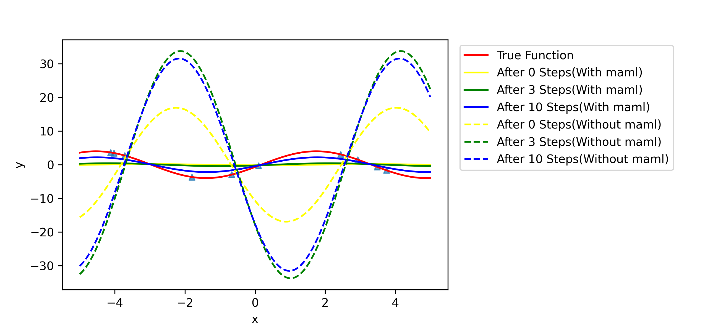
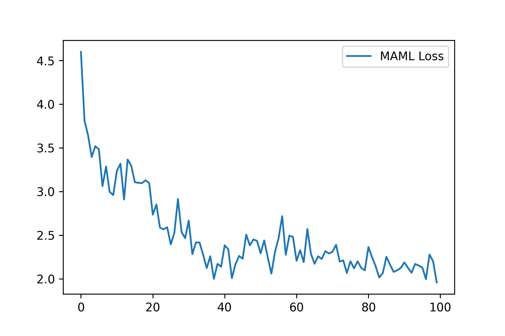
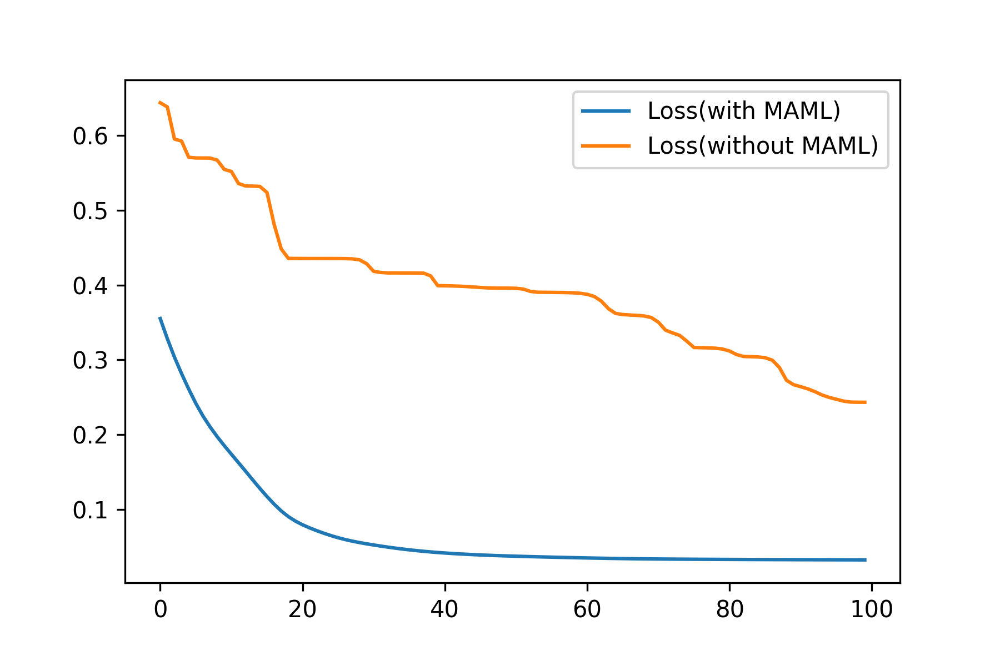

## Introduction

​	MAML is a machine learning technique used to train ML models that can quickly adapt to new tasks. The key idea behind MAML is to train a large number of ML models and calculate the mean parameter values. This allows us to obtain a set of parameters suitable for most parameters' combination situations of ML models.

​	Here, two examples of MAML applied to fully connected neural networks for solving the sine function and a toy dataset are implemented based on fundamental principles solely.

## muitilayerNN.py

​	Use a multi-layer neural network to fix the sine function $y=asin(x+b)$ where $a$ and $b$ are random variables. The NN has the structure below:
$$
h_1=XW_1+b_1\\
h_2=h_1D\\
y=h_2W_2+b_2
$$
Where $D$ is a diagonal matrix and $W_2$ is an all-ones matrix. This is an uncommon structure and I want to show that it still has a great fixing ability. 

​	 The results of the neural network with MAML-initialized parameters and randomly initialized parameters are compared. The results display the fitted curve based on the predicted points by the neural network, as follows.



### parameters

* lba: the lower bound of a
* uba: the upper bound of a
* lbb: the lower bound of b
* ubb: the upper bound of b
* lb: the lower bound of x
* ub: the lower bound of x
* lr: the learning rate for MAML training
* lr1: the learning rate for testing, which is applied to both MAML-initialized and randomly initialized neural networks
* input_dim: the input dimensionality of the neural network. In this example it is set to 1 constantly
* hidden1_dim: the dimensionality of the hidden layer
* out_dim: the output dimensionality of the neural network. In this example it is set to 1 constantly
* epochs: the number of MAML training epochs
* tasks: the number of MAML training tasks
* beta: the updating rate of MAML
* D_point_train: the number of points for MAML training at one time
* D_point_test: the number of points for MAML testing at one time
* points: the total number of points for displaying in the result

## muitilayerNN_toydata.py

​	Implement a fully connected neural network with 2 hidden layers for regression on the breast cancer dataset from scikit-learn. Compare the results of the neural network with MAML-initialized parameters and randomly initialized parameters. Here the hyperbolic tangent (tanh) activation function is applied. Display the loss curve during MAML training, the loss curve on the testing data for both MAML-initialized and randomly initialized neural networks, and the predicted results as follows:






### parameters

* lr: the learning rate for MAML training
* lr1: the learning rate for testing, which is applied to both MAML-initialized and randomly initialized neural networks

* input_dim: the input dimensionality of the neural network. In this example it is set to the size of features constantly
* hidden1_dim: the dimensionality of the first hidden layer
* hidden2_dim: the dimensionality of the second hidden layer
* out_dim: the output dimensionality of the neural network. In this example it is set to 1 constantly
* epochs: the number of MAML training epochs
* tasks: the number of MAML training tasks
* beta: the updating rate of MAML
* D_point_train: the number of points for MAML training at one time
* D_point_test: the number of points for MAML testing at one time

​	The dataset can be changed to any other dataset supplied by scikit-learn by modifying:

```python
from sklearn.datasets import load_diabetes
```

